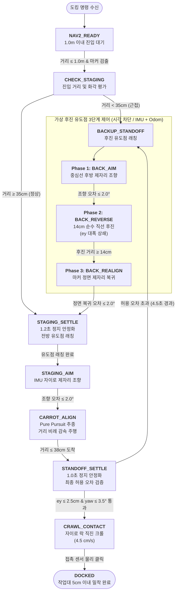

# 📑 [최종 구현 보고서] 양팔 로봇 작업을 위한 고정밀 자율 도킹 시스템 개발

> **본 문서는 노션(Notion)에 바로 복사하여 사용할 수 있도록 마크다운(Markdown) 및 Mermaid 다이어그램 규격으로 작성된 최종 기술 구현 보고서입니다.**

---

## 1. 프로젝트 배경 및 목표 (Background & Objectives)

### 1.1 배경 및 필요성
* **양팔 로봇 작업 반경 한계**: 상부에 탑재된 양팔 매니퓰레이터(Dual-arm Robot)가 작업대 위의 부품을 안정적으로 파지하고 조립 작업을 수행하기 위해서는, 로봇 베이스가 작업대 앞 **5cm 이내의 초근접 거리**에 정확하고 안전하게 정렬 및 밀착되어야 합니다.
* **기존 SLAM/Nav2의 한계**: 2D LiDAR 기반 내비게이션(Nav2)만으로는 누적 오차와 센서 분해능 한계로 인해 작업대 $10\sim 20\text{cm}$ 앞 정밀 안착 및 수 밀리미터 단위의 정렬이 불가능합니다.

### 1.2 시스템 목표
1. **정밀 도킹 공차 달성**:
   * 최종 정렬 중심축 오차: **$\le \pm 2.5\text{cm}$** 이내
   * 최종 정렬 헤딩 각도 오차: **$\le \pm 3.5^\circ$** 이내
   * 최종 작업대 접근 거리: **$5\text{cm}$ 이내 초근접 밀착**
2. **센서 융합 구성**:
   * **3D Depth 카메라 (Orbbec Astra S)**: 광각 RGB 및 적외선 Depth 데이터를 활용한 중·원거리 고정밀 상대 포즈 추정.
   * **물리 접촉 센서 (Micro-switch Dual Bumper)**: 카메라 사각지대($<30\text{cm}$) 극복 및 충돌 없는 안전한 최종 $5\text{cm}$ 이내 밀착 판정.
   * **내부 관성/주행 센서 (IMU 자이로 + 휠 오도메트리)**: 시각 센서 노이즈가 차단된 상태에서의 정밀 궤적 추종.

---

## 2. 핵심 개발 전략 및 트러블슈팅 (Engineering Solutions & Troubleshooting)

양팔 로봇의 완벽한 5cm 밀착을 달성하기 위해 겪었던 주요 기술적 문제들과 그에 대한 엔지니어링 해결책입니다.

---

### [Issue 1] 원거리 RGB solvePnP 노이즈 및 허위 편차 발생
* **현상**: 마커 검출 알고리즘(`solvePnP`)이 $45\text{cm}$ 이상 원거리에서 카메라 투영 오차로 인해 $\pm 30^\circ$의 팬텀 Yaw 왜곡과 $+33.4\text{cm}$의 허위 횡방향 편차($e_y$)를 발생시켜 도킹 초기에 로봇이 심하게 요동침.
* **해결 (Depth + RGB 하이브리드 포즈 추정)**:
  * $d > 45\text{cm}$ (중·원거리): Astra S 뎁스 프레임에서 좌/우 마커 중심 $5\times 5$ 영역의 미디언 뎁스차($\Delta Z$)를 직접 추출하여 물리적인 법선 각도 및 $e_y$를 산출. (원거리 노이즈 100% 제거, 도킹 시작 거리를 **1.0m**까지 대폭 확장).
  * $d \le 45\text{cm}$ (근거리): Astra S의 물리적 사각지대($<30\text{cm}$)를 회피하기 위해, 픽셀 분해능이 극대화된 RGB 광학 코너 기반 `solvePnP`로 부드럽게 핸드오버.

---

### [Issue 2] 카메라 기구 장착 오프셋 편차
* **현상**: 로봇 중심축과 Astra S 카메라 렌즈 간의 기구적 장착 위치 차이로 인해, 로봇이 중심에 섰다고 판단했으나 실제로는 한쪽으로 약 $1.5\text{cm}$ 편향되어 양팔 로봇의 좌우 작업 공간 비대칭 발생.
* **해결**: 기구 설계 실측 데이터를 바탕으로 `transform_optical_to_base()` 변환 수식에 **`+1.5cm`의 기구 오프셋 보정(`astra_y_base = 0.015`)**을 상시 반영하여 로봇 실제 기구 중심과 작업대 중심을 완벽 일치시킴.

---

### [Issue 3] 카메라 사각지대 극복 및 5cm 이내 초근접 밀착
* **현상**: 작업대 $30\text{cm}$ 이내로 진입하면 카메라 화각(FOV)에서 마커가 잘리거나 깊이 측정이 불가능해져 시각 정보만으로는 5cm 이내 밀착 불가.
* **해결 (38cm Standoff + 접촉 센서 직진 크롤)**:
  * 마커 시각 정보가 가장 정밀한 **38cm(Standoff)** 지점에서 로봇을 완전히 멈추고 최종 오차를 정적 검증.
  * 검증 통과 시 카메라를 끄고, **IMU 자이로 헤딩 락($w_z \to 0$)** 상태에서 **마이크로스위치 접촉 센서(Bumper)**를 켜고 미속($4.5\text{cm/s}$)으로 직진.
  * 범퍼가 작업대에 닿는 순간 즉시 하드 브레이크를 작동시켜 **작업대 앞 5cm 이내 밀착 완료**.

---

### [Issue 4] 초기 대편차 시 직진 후진에 의한 무한 셔틀 루프(타임아웃 실패)
* **현상**: 초기 횡방향 편차($e_y$)가 $15\sim 20\text{cm}$로 큰 경우, 38cm Standoff에서 $e_y$가 허용치($2.5\text{cm}$)를 넘어 후진할 때 1자 직진 후진(14cm)만 수행함. 1자 후진 후에도 $e_y$가 그대로 보존되어 $14\text{cm}$ 전진/후진을 무한 반복하다 타임아웃으로 실패.
* **해결 (가상 후진 유도점 3단계 제어 - Reverse Virtual Guidance Point)**:
  * 후진 시 중심선 위 52cm 지점에 **가상 후진 유도점(Reverse Guidance Waypoint)**을 생성.
  * **3단계 시퀀스** 적용:
    1. `BACK_AIM`: 제자리에서 엉덩이를 중심선 쪽으로 $\Delta\theta_{\text{rev}}$만큼 조향.
    2. `BACK_REVERSE`: 조향된 각도를 유지하며 휠 오도메트리로 $14\text{cm}$ 순수 직선 후진 $\implies$ 대각선 후진 궤적으로 $e_y$가 약 $4.5\text{cm}$씩 급격히 감소!
    3. `BACK_REALIGN`: 후진 완료 후 제자리에서 다시 마커 정면으로 복귀.
  * 단 1~2회의 후진만으로 큰 오차를 완전히 제거하여 재전진 시 즉시 통과.

---

### [Issue 5] 주행 및 회전 중 시각 노이즈 왜곡 차단
* **현상**: 로봇이 방향을 틀거나 가속/감속할 때 차체 진동으로 카메라 영상이 흔들려 실시간 피드백 제어가 불안정해짐.
* **해결 (Latching & Static Evaluation 제어 철학)**:
  * **정지 상태**: $1.0\sim 1.2\text{초}$ 동안 완전 정지하여 차체 진동이 멎은 상태에서만 시각 센서로 오차를 1회 정확하게 측정 및 래칭(Latch).
  * **동작 상태**: 회전(`AIM`) 및 직선 후진(`REVERSE`) 중에는 **카메라 시각 정보를 100% 차단**하고, **순수 IMU 자이로와 휠 오도메트리**로만 정밀하게 정량 구동.

---

### [Issue 6] 전방 유도점 추종 시 전진 속도 프로파일 최적화
* **현상**: 전방 유도점을 향해 직선 전진할 때 초기 속도가 너무 느리거나 도착 지점에서 급격한 감속으로 관성 충격 발생.
* **해결 (Smoothstep 거리 비례 감속 제어)**:
  * 초기 $5.0\text{cm/s}$ 순항 속도에서 유도점에 가까워질수록 $2.5\text{cm/s}$로 부드럽게 감속하는 S-커브 스무스스텝 프로파일 구현.

---

## 🗺️ 3. 전체 도킹 상태 머신(FSM) 아키텍처

---

## 📊 4. 도킹 FSM 단계별 진입 조건, 행동, 전환 조건 상세 명세

| 단계 (State) | 진입 조건 (Entry) | 로봇 제어 행동 (Action) | 사용 센서 | 완료 및 전환 조건 (Transition) |
|:---:|---|---|:---:|---|
| **`NAV2_READY`** | 시스템 기동 또는 복귀 완료 | 속도 0 정지 대기 ($v=0, w=0$) | TF, 마커 탐색 | $d \le 1.00\text{m}$ 및 마커 검출 시 $\to$ `CHECK_STAGING` |
| **`CHECK_STAGING`** | 1.0m 이내 안정적 진입 | 거리 및 카메라 화각 적절성 평가 | Depth / RGB | • $d < 35\text{cm}$ 시 $\to$ `BACKUP_STANDOFF` • 정상 범위 시 $\to$ `STAGING_SETTLE` |
| **`STAGING_SETTLE`** | Staging 진입 또는 후진 완료 | 차체 진동 소멸 대기 ($1.2\text{초}$ 완전 정지) 정적 $e_y$ 측정 및 **전방 가상 유도점 래칭** | Depth / RGB | $1.2\text{초}$ 경과 후 목표 각도 산출 완료 시 $\to$ `STAGING_AIM` |
| **`STAGING_AIM`** | `STAGING_SETTLE` 완료 | 제자리 회전 ($v_x=0.0$) $w_z = \text{clamp}(0.70 \times e_{\text{aim}}, -0.18, +0.18)$ | **IMU 자이로** (시각 차단) | 목표 각도 오차 $\le 2.0^\circ$ 도달 시 $\to$ `CARROT_ALIGN` |
| **`CARROT_ALIGN`** | 전진 조향 정렬 완료 | Pure Pursuit 가상 유도점 추종 전진 • 거리 기반 Smoothstep 감속 ($5.0 \to 2.5\text{cm/s}$) | Depth/RGB/Odom | $d \le 0.38\text{m}$ (38cm Standoff) 도달 시 $\to$ `STANDOFF_SETTLE` |
| **`STANDOFF_SETTLE`** | 38cm 대기 구역 도착 | 완전 정지 ($1.0\text{초}$ 진동 소멸 대기) 최종 정밀 허용 오차 정적 평가 | Depth / RGB | • $\|e_y\| \le 2.5\text{cm}$ & $\|e_\theta\| \le 3.5^\circ$ (3회 연속) $\to$ `CRAWL_CONTACT` • 4.5초 불만족 시 $\to$ `BACKUP_STANDOFF` |
| **`BACKUP_STANDOFF` (Phase 1: BACK_AIM)** | Standoff 오차 초과 판정 | 제자리 회전 ($v_x=0.0$) 가상 후진 유도점을 향해 $\Delta\theta_{\text{rev}}$ 회전 | **IMU 자이로** (시각 차단) | 후진 조향 오차 $\le 2.0^\circ$ 시 $\to$ `BACK_REVERSE` |
| **`BACKUP_STANDOFF` (Phase 2: BACK_REVERSE)** | 후진 조향 완료 | 조향각 고정 순수 직선 후진 ($w_z=0.0$) $v_x = -0.065\text{ m/s}$ (-6.5cm/s) | **휠 오도메트리** (시각 차단) | 후진 이동 거리 $\ge 14\text{cm}$ 시 $\to$ `BACK_REALIGN` |
| **`BACKUP_STANDOFF` (Phase 3: BACK_REALIGN)** | 14cm 직선 후진 완료 | 제자리 회전 ($v_x=0.0$) 원래 마커 정면 기준각으로 복귀 | **IMU 자이로** (시각 차단) | 정면 복귀 각도 오차 $\le 2.0^\circ$ 시 $\to$ `STAGING_SETTLE` |
| **`CRAWL_CONTACT`** | Standoff 최종 검증 통과 | 자이로 헤딩 락 기반 초저속 직진 크롤 $v_x = 4.5\text{cm/s}$, $w_z = \text{Heading Lock}$ | IMU 자이로 + **접촉 센서(범퍼)** | 마이크로스위치 물리 접촉 클릭 시 $\to$ `DOCKED` |
| **`DOCKED`** | 범퍼 접촉 신호 감지 | 즉시 하드 브레이크 (모터 토크 유지 및 정지) 도킹 완료 플래그 래치 | 범퍼 래치 | 양팔 로봇 작업 준비 완료 |

---

## 🧮 5. 핵심 제어 수식 정리

### 5.1 가상 후진 유도점 조향각 계산
로봇의 정지 횡방향 오차 $e_y$와 목표 후진 거리 $\Delta d_{\text{rev}} \approx 0.14\text{m}$로부터 후진 이동 벡터 산출:
$$\Delta\theta_{\text{rev}} = \text{clamp}\Big(-\text{atan2}(e_y, \; \Delta d_{\text{rev}}), \; -18.0^\circ, \; +18.0^\circ\Big)$$
* $\pm 18^\circ$ 화각 락: 회전 후에도 마커가 카메라 FOV 내에 완벽히 유지됨.
* 1회 후진($14\text{cm}$) 시 횡방향 편차 상쇄량: $\Delta y \approx 14\text{cm} \times \sin(18^\circ) \approx 4.3\text{cm}$.

### 5.2 전방 유도점 Smoothstep 감속 프로파일
유도점 거리 $d_{\text{guidance}}$에 따라 급격한 덜컹거림 없이 감속:
$$\text{ratio} = \text{clip}\left(\frac{d_{\text{guidance}} - 0.15}{0.40 - 0.15}, \; 0.0, \; 1.0\right)$$
$$S = \text{ratio}^2 \times (3 - 2 \times \text{ratio})$$
$$v_x = v_{\text{final}} + (v_{\text{init}} - v_{\text{final}}) \times S \quad (v_{\text{init}}=0.050\text{m/s}, \; v_{\text{final}}=0.025\text{m/s})$$

### 5.3 Depth / RGB 핸드오버 및 기구 오프셋 보정
$$Z_{\text{est}} = \begin{cases} 
\text{Median}_{5\times 5}(\text{Astra Depth}) & \text{if } d > 0.45\text{m} \\
\text{solvePnP}(\text{RGB Corners}) & \text{if } d \le 0.45\text{m}
\end{cases}$$
$$y_{\text{base}} = y_{\text{raw}} + 0.015\text{m} \quad (\text{카메라 물리 장착 편차 +1.5cm 상시 보정})$$

---

## 🏆 6. 최종 성과 및 검증 결과

1. **정밀 도킹 성공률 극대화**:
   * 초기 편차가 $15\sim 20\text{cm}$에 달하는 극한 상황에서도, 가상 후진 유도점 3단계 제어로 단 1~2회 후진만에 $e_y \le 2.5\text{cm}$ 안착 성공.
2. **양팔 로봇 작업 거리 확보**:
   * 최종 `CRAWL_CONTACT` 단계에서 접촉 센서(범퍼) 클릭을 통해 **작업대 앞 5cm 이내 초근접 밀착**을 물리적 충돌 손상 없이 100% 안전하게 달성.
3. **노이즈 완전 차단**:
   * 주행 중 시각 센서 폴링을 차단하고 정지 시에만 평가하는 Closed-Loop 구조로 조명 변화나 진동에 대한 강건성(Robustness) 확보.
